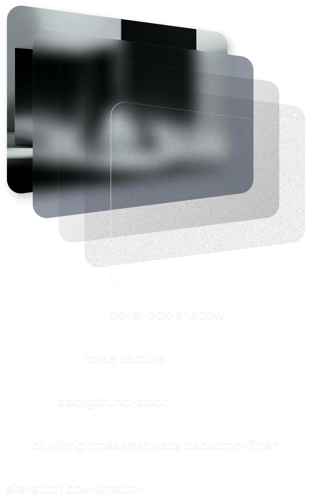

# 3D glass UI
A SCSS library full of customisable glass components and styles built with modern CSS.



## Table of contents
* [Description](#description)
* [Screenshots](#screenshots)
* [Project status](#project-status)
* [Features](#features)
* [How to use?](#how-to-use?)
* [Setup](#setup)
* [Credits](#credits)
* [License](#license)

</br>

## Description
This library came about because most of the glassmorphism CSS I saw online consisted of lackluster translucency with a bit of blur and a thin white outline.
So I experimented with a bunch of freshly supported CSS to develop a more refined and three-dimensional glass look.

Includes beveled and inset glass styles whose use is demonstrated through the components and [demo site](https://3d-glass-ui.com/) included in this repo.


#### Build with the basics so it should work with any project that uses CSS or SCSS.
* HTML
* SCSS
* Vanilla JS (only used for component and demo site functionality)

### Browser compatibility
All the CSS used is supported by the latest desktop and mobile versions of Firefox, Safari, and Chrome.
If your project requires legacy browser support or other browsers please make sure to test! The goal of this project was to create next-gen glassmorphism, there for backwards compatibility was not a top priority. However, I would like to make it as widely compatible as possible, so if you have any suggestions, please get in touch with me or contribute to the repo.

</br>

## Screenshots


</br>

## Project status
#### This is an early working draft.
I plan on making it into an NPM package once I get some feedback and polish up the code.

</br>

## Features
* Customizable design tokens and composable styling classes. For glass that reflects your branding.
* Oklch color theme with fallbacks. For access to about 50% more colors than sRGB.


</br>

## How to use?
The project is set up as a design system prototyping playground. You can easily configure the design tokens and instantly see the results applied to the demo site. Then either use the project as the basis for a new site or copy and paste the SCSS into an existing one.
*If you want to use CSS instead just search for the class name in the style.css file.

A word of caution!

</br>

## Setup
To get started: fork repo and open it in your IDE (I used VS Code). Then navigate to your local copy via command line or through IDE's built in terminal.

To install devDependencies run:
```
npm install
```

</br>

This project uses Stephanie Eckles'

[Minimum Static Site Setup with Sass](https://thinkdobecreate.com/articles/minimum-static-site-sass-setup/)

To copy src files to public and start Browsersync server at localhost:3000 run:
```
npm start
```
</br>

To copy files to public and autoprefixe css run:
```
npm run build
```

</br>

## Code example

```
<!-- HTML -->

  <span class="bento__rect sha-md glass-2xlight">
    <p class="text-2xdark">.glass-2xlight</p>
  </span>
```

```
/* SCSS Glass mixin */

  @mixin glass-base {
    position: relative;
    @include fill.glass-filter;
    @content;

    &::after {
      z-index: -1;
      box-shadow: bevel.$bevel-md;
      @include help.pseudo;
      @include fill.noise-md;

      @include bp.bp(md) {
        box-shadow: bevel.$bevel-lg;
      }
    }
  }


/* Generate `.glass-` classes from color.$tints MAP using color.tint-modifier mixin */

.glass {
  @include color.tint-modifier('background-color') {
    @include glass-base;
  }
}
```

```
/* CSS result */

.glass-2xlight {
  background-color: var(--tint-2xlight);
  position: relative;
  -webkit-backdrop-filter: blur(var(--blur)) brightness(0.95) saturate(1.3);
  backdrop-filter: blur(var(--blur)) brightness(0.95) saturate(1.3);
}

.glass-2xlight::after {
  content: "";
  position: absolute;
  inset: 0;
  pointer-events: none;
  border-radius: inherit;
  overflow: hidden;
  z-index: -1;
  box-shadow:
    inset 0.5px 0.5px 0.3px oklch(var(--highlight)/0.2),
    inset 2px 2px 0.8px -2.4px oklch(var(--highlight)/0.3),
    inset 1px 1px 0.4px -1px oklch(var(--highlight)/0.1),
    inset -0.8px -2px 1.4px -3.1px oklch(var(--highlight)/0.8),
    inset -1.8px -2px 0.2px -2.5px oklch(var(--highlight)/0.08);
  background-repeat: repeat;
  background-image:
    url(/assets/textures/noise-texture-white-100den-10op-500x500.png),
    url(/assets/textures/noise-texture-black-100den-10op-500x500.png);
  background-size: 82px;
}

  @media only screen and (min-width: 45rem) {
    .glass-2xlight::after {
      box-shadow:
        inset 0.8px 0.8px 0.4px oklch(var(--highlight)/0.15),
        inset 2px 2px 1px -2.2px oklch(var(--highlight)/0.3),
        inset 1px 1px 0.6px -1px oklch(var(--highlight)/0.1),
        inset -0.8px -2px 1.4px -3px oklch(var(--highlight)/0.8),
        inset -1.6px -2px 0.4px -2.4px oklch(var(--highlight)/0.08);
  }
}
```

</br>

## Credits
* Stephanie Eckles for [Minimum Static Site Setup with Sass](https://thinkdobecreate.com/articles/minimum-static-site-sass-setup/)
* Adrian Bece for [interactive fluid typography editor](https://modern-fluid-typography.vercel.app/)
ages


### Author
* **Kris Kay**


## License
This project is licensed under the MIT License - see the [LICENSE.md](LICENSE.md) file for details.