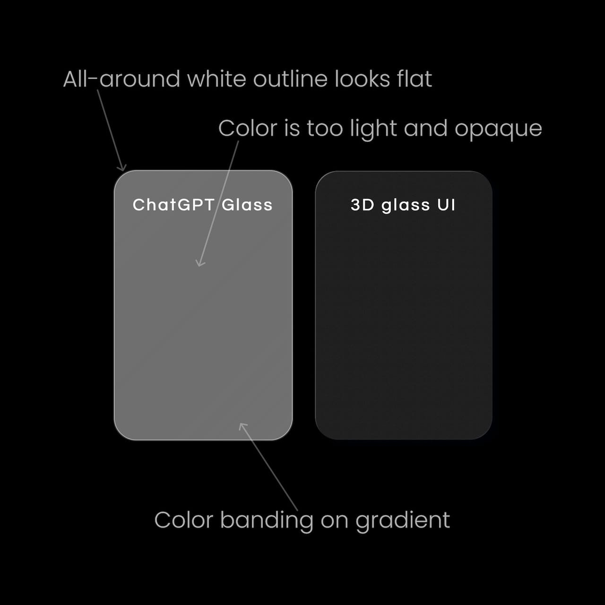
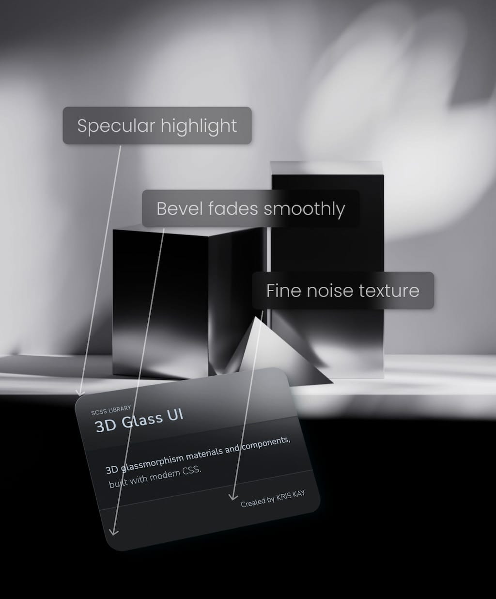
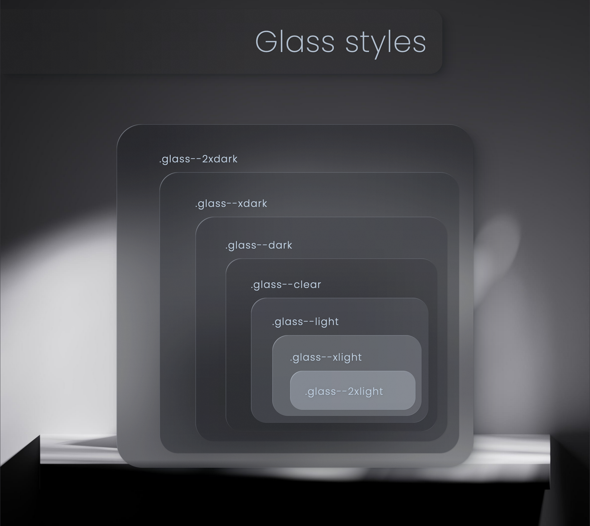
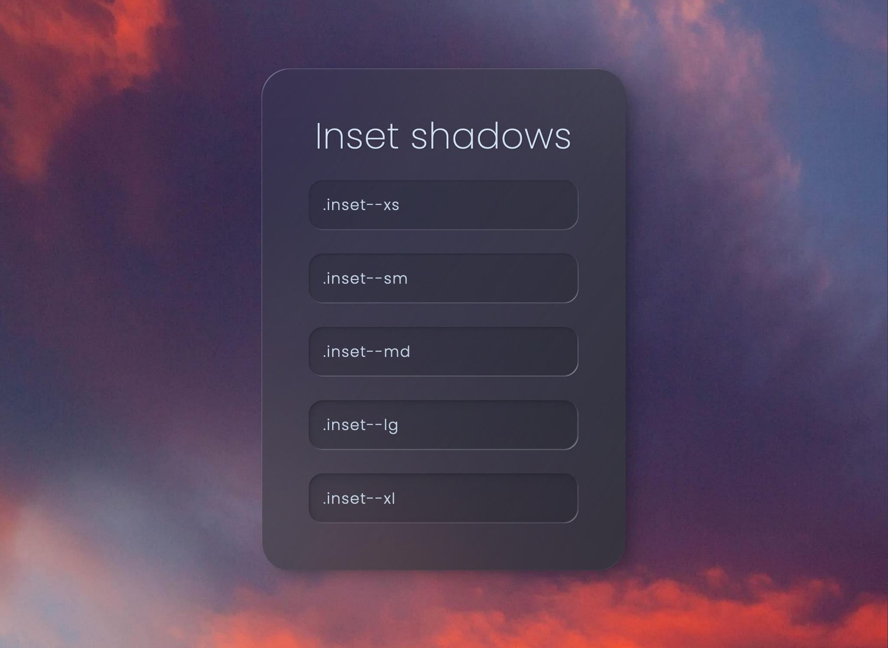

# 3D glass UI
3D glassmorphism materials and components, built with modern CSS.

<div align="center" width="100%">
  
</div>

## Table of contents
* [Description](#description)
* [Screenshots](#screenshots)
* [Setup](#setup)
* [Credits](#credits)
* [License](#license)

</br>

## Description
#### This is an early draft of the 3D glass UI library.

The project is set up as a design system prototyping playground. You can easily configure the design tokens and instantly see the results applied to the [demo site](https://3d-glass-ui.com/).
Includes beveled and inset glass styles whose use is demonstrated through the components included in this repo.


<div align="center" width="100%">
  
  
</div>

### Features
* Customizable design tokens and composable styling classes. *For glass that reflects your branding.*
* Oklch color theme with fallbacks. *For access to about 50% more colors than sRGB.*
* Fluid typography and sizing. *For elements that scale with viewport width.*

### Build with
* HTML
* CSS (SCSS)
* Vanilla JS

### Browser compatibility
##### All the CSS used is supported by the latest desktop and mobile versions of Firefox, Safari, and Chrome.
If you require legacy browser support please make sure to test! The goal of this project was to create next-gen glassmorphism, therefore backwards compatibility was not a top priority.

</br>

## Screenshots

</br>
<div align="center" width="100%">
  
</div>

</br>

<div align="center" width="100%">
  
</div>

</br>


<div align="center" width="100%">
  
</div>

</br>


## Setup
This project uses Stephanie Eckles'
[Minimum Static Site Setup with Sass](https://thinkdobecreate.com/articles/minimum-static-site-sass-setup/)

To get started:
1. Make sure you have Node, Npm, and Git installed.
2. Install Node modules.
```
npm install
```

</br>

3. Copy src files to public and start Browsersync server at localhost:3000.
```
npm start
```

</br>

## Credits
* Stephanie Eckles for [Minimum Static Site Setup with Sass](https://thinkdobecreate.com/articles/minimum-static-site-sass-setup/)
* Adrian Bece for [interactive fluid typography editor](https://modern-fluid-typography.vercel.app/)
* James Gilyead & Trys Mudford for [Fluid Space Calculator](https://utopia.fyi/space/calculator/)
* Chris Coyier for [change SVG color with mask](https://css-tricks.com/change-color-of-svg-on-hover/)
* Ahmad Salameh for [Noise texture generator](https://devsdash.com/tools/noise-texture-generator)


## Author
**Kris Kay**
* hello@kris-kay.com

* [My LinkedIn](https://www.linkedin.com/in/kris-kay/)

* [My GitHub](https://github.com/Kris-Kay)


## License
This project is licensed under the MIT License - see the [LICENSE.md](LICENSE.md) file for details.